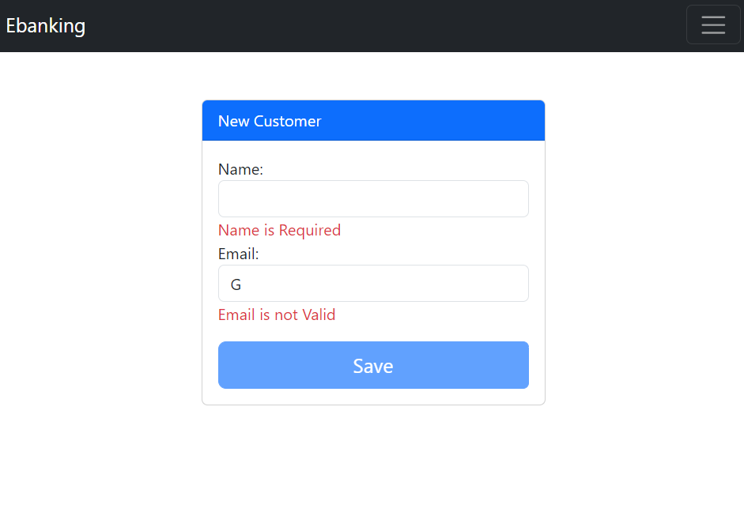

<h1>Frontend de l'application</h1>

Le présent rapport décrit la partie frontend de l'application web "EBanking" qui a été conçue avec le framework Angular. 
Cette application offre diverses fonctionnalités pour la gestion des opérations bancaires en ligne, notamment la consultation des
comptes, la gestion des clients, ainsi que les opérations financières telles que le débit, le crédit et le transfert.

<ol>
<li> Création d'un projet Angular</li>
<li> Création des composants : Navbar, Customers, Accounts, New-customer, Customer-accounts</li>
<li> Création des models : Customer.model.ts, Account.model.ts</li>
<li> Création des Services pour les Clients et les comptes : Customers.service, Accounts.service</li>
<li> La définition des routes dans app-routing.module.ts</li>
</ol>

<h2>Partie 1 : Customers</h2>

La partie "Customers" se compose de deux parties distinctes : la première dédiée à la consultation des clients déjà existants, et la seconde à l'ajout de nouveaux clients 

<h3>Consultation des clients</h3>

Cette partie permet d'afficher la liste des clients déjà enregistrés. Elle inclut un champ de recherche qui permet de filtrer les clients en fonction de mots-clés.Pour chaque client, un tableau contenant des informations telles que l'identifiant, le nom et l'adresse e-mail. En outre, trois boutons sont mis à disposition pour supprimer le client ,modifier ,ou accéder à ses comptes.

h3>Ajout de nouveaux clients</h3>

<h2>Partie 2 : Accounts</h2>

La partie "Accounts" permet de consulter les informations d'un compte spécifique et d'effectuer des opérations financières(Débit,Crédit et Transfert).

<h3>Consultation d'un compte </h3>

<h3>Les opérations financières</h3>
<h3>Débit</h3>

<h3>Crédit</h3>

<h3>Transfert</h3>

